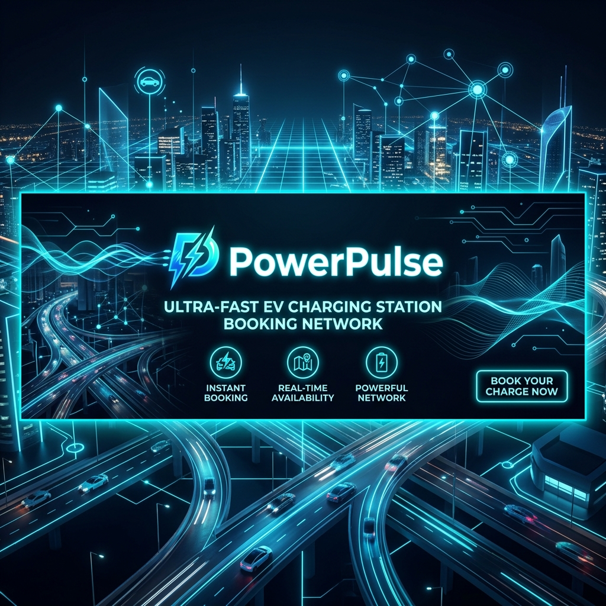
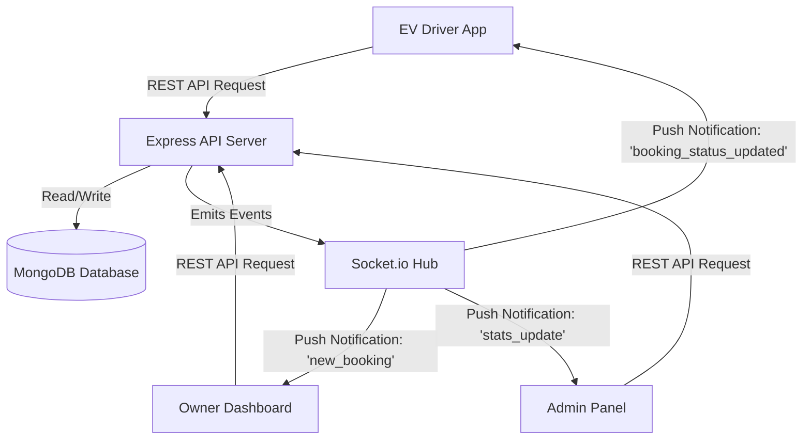

# ⚡ PowerPluse — Next-Gen EV Charging Network & Slot Booking System

[](https://react.dev/)
[](https://nodejs.org/)
[](https://expressjs.com/)
[](https://www.mongodb.com/)
[](https://tailwindcss.com/)
[](https://socket.io/)

---



PowerPluse is a state-of-the-art, premium full-stack platform designed to bridge the gap between Electric Vehicle (EV) drivers and EV charging station owners. Incorporating a gorgeous modern UI, robust slot booking mechanics, multi-tier user access control, and real-time dashboard updates via WebSockets, PowerPluse offers a seamless, reliable experience for electric travel.

---

## 🚀 Key Features

### 👤 For EV Drivers (Users)
* **Flexible Payments**: Seamless checkout supporting both **Online (UPI/Card)** and **At-Station Cash** payment options.
* **Guaranteed Advance Booking**: Reserve booking slots up to 24 hours in advance to guarantee a hassle-free charging session.
* **Real-time Search & Filter**: Find active stations dynamically. Filter by location, city, pricing, available slots, and connector types (Level 1, Level 2, DC Fast).
* **Smart Dashboard**: Monitor current, upcoming, and past booking statuses. Read and write station reviews.

### 🏢 For Station Owners
* **Booking & Revenue Analytics**: Comprehensive dashboard showing real-time earnings, daily booking counts, pending requests, and station occupancy data.
* **Live Status Modifications**: Instantly confirm or cancel bookings; updates are pushed directly to the driver's screen in real time.
* **Slot & Pricing Controls**: Customize total available slots, operational hours, charging slot duration (default 60 mins), and configure dynamic price per kWh for Level 1, Level 2, and DC Fast charging.
* **Station Registration**: Easy-to-use registration form to list stations on the network.

### 👑 For Administrators
* **Centralized Dashboard**: Track total users, active stations, total successful charges, and platform-wide revenue.
* **Platform Taxation**: Configure custom tax rates for approved stations to generate revenue from the network.
* **Station Moderation**: Review incoming station registration requests; approve, reject, or block owners to guarantee safety and compliance.

---

## 🛠️ Tech Stack & Architecture

### Technology Breakdown

| Layer | Technology | Primary Libraries / Packages |
| :--- | :--- | :--- |
| **Backend** | Node.js, Express.js | Mongoose, Socket.io, JSON Web Tokens (JWT), BcryptJS |
| **Database** | MongoDB | Mongoose ODM (Object Document Mapper) |
| **Frontend** | React 18, Tailwind CSS | Vite, Lucide React, Axios, Socket.io-client, React Router Dom |
| **Styling** | Custom Tailwind CSS | Fluid gradients, Glassmorphism, Modern typography (Inter/Outfit) |

---

## 🧬 System Architecture

The following diagram illustrates the interaction between the React frontend, the Node/Express backend, the MongoDB database, and WebSockets (Socket.io) for real-time notifications:



---

## 📂 Project Directory Structure

```filepath
PowerPluse/
├── backend/
│   ├── config/              # DB connection config
│   ├── controllers/         # Request handling & business logic
│   ├── middleware/          # JWT Auth, roles validation (Owner, Admin)
│   ├── models/              # Mongoose database models (User, Station, Booking, Review)
│   ├── routes/              # Express API Endpoint definitions
│   ├── server.js            # Entry point for backend HTTP & Socket.io server
│   └── .env                 # Environment variables config
├── frontend/
│   ├── public/              # Static assets
│   ├── src/
│   │   ├── assets/          # Project images & local files
│   │   ├── context/         # AuthContext & global state management
│   │   ├── pages/           # Application Pages (Landing, Dashboards, StationDetails)
│   │   ├── App.jsx          # Route configurations and app wrapper
│   │   ├── index.css        # Core custom styles and Tailwind utilities
│   │   └── main.jsx         # App bootstrapping
│   ├── vite.config.js       # Vite configuration with API Proxy rules
│   └── package.json         # Frontend dependencies and scripts
└── README.md                # Documentation (You are here)
```

---

## ⚙️ Getting Started & Local Setup

### Prerequisites
* [Node.js](https://nodejs.org/en) (v16.x or higher)
* [MongoDB](https://www.mongodb.com/try/download/community) (Local instance running or MongoDB Atlas Connection string)

### 1. Database & Environment Configuration

Create a `.env` file in the `backend/` directory and configure the following parameters:

```env
PORT=5000
MONGO_URI=mongodb://localhost:27017/chargenowev
JWT_SECRET=supersecretjwtkey_chargenowev
FRONTEND_URL=http://localhost:5173
```

### 2. Backend Setup
Navigate to the `backend/` directory, install packages, and launch the development server:

```bash
cd backend
npm install
npm run dev
```
The server will boot up on `http://localhost:5000`.

### 3. Frontend Setup
Navigate to the `frontend/` directory, install packages, and boot the Vite development server:

```bash
cd ../frontend
npm install
npm run dev
```
The client app will open automatically on `http://localhost:5173`. 
> **Note**: Vite has been pre-configured to proxy all request paths matching `/api` to the backend server running at `http://localhost:5000` to avoid CORS issues.

---

## 🔗 Key API Endpoints Reference

### 🔐 Authentication Routes (`/api/auth`)
* `GET /api/auth/me` — Retrieve the current authenticated user's profile.
* `POST /api/auth/login` — Login user and receive a JWT Bearer token.
* `POST /api/auth/register` — Register a new account (roles: `'user'`, `'owner'`).
* `PUT /api/auth/profile` — Update account profile details (Name, Mobile number).

### ⛽ Charging Stations (`/api/stations`)
* `DELETE /api/stations/:id` — Delete a station (requires `owner` token).
* `GET /api/stations` — Get all approved stations (public search).
* `GET /api/stations/:id` — View details of a specific station.
* `GET /api/stations/owner` — Get list of stations registered by the currently logged-in owner.
* `POST /api/stations` — Add a new charging station (requires `owner` token).
* `POST /api/stations/:id/reviews` — Leave a review & rating (requires authenticated `user` token).
* `PUT /api/stations/:id` — Edit station specs (slots, hours, photos, pricing) (requires `owner` token).

### 📅 Bookings (`/api/bookings`)
* `GET /api/bookings` — Retrieve bookings history of the logged-in user.
* `GET /api/bookings/owner/earnings` — Get overall and weekly earnings metrics for the owner's dashboard.
* `GET /api/bookings/station/:stationId` — Retrieve all bookings for a specific station (requires `owner` token).
* `GET /api/bookings/station/:stationId/slots` — Get list of occupied slots for specific date to identify availability.
* `POST /api/bookings` — Create a new slot booking (requires `user` token).
* `PUT /api/bookings/:id/status` — Modify booking status (`'confirmed'`, `'completed'`, `'cancelled'`) (requires `owner` token).

### 👑 Administration (`/api/admin`)
* `DELETE /api/admin/users/:id` — Remove a user account from the system.
* `GET /api/admin/stations` — Retrieve all registered stations (approved & pending).
* `GET /api/admin/stations/pending` — Fetch only pending stations requiring approval.
* `GET /api/admin/stats` — Fetch key metrics (total platform users, total bookings, revenue metrics).
* `GET /api/admin/users` — Get details of all registered users on the system.
* `PUT /api/admin/stations/:id/status` — Set station status to `'approved'`, `'rejected'`, `'blocked'`.
* `PUT /api/admin/stations/:id/tax` — Adjust dynamic service taxation percentage.

---

## 📡 Real-time Socket.io Flow

PowerPluse integrates Socket.io to keep client interfaces continuously updated without polling. Here are the active event listeners:

| Event Name | Sent From | Description |
| :--- | :--- | :--- |
| `booking_status_updated` | Server | Broadcasts to the EV Driver when the station Owner confirms, completes, or cancels a booking. |
| `connection` | Client | Emitted when user logs in and establishes real-time connection. |
| `new_booking` | Server | Broadcasts to the station Owner when an EV Driver creates a new booking. |

---

## 🔒 Security Practices Built-In
* **CORS Policy Configuration**: Socket.io and REST APIs restrict requests to configured client domains only.
* **Password Hashing**: Passwords are encrypted utilizing `bcryptjs` with 10-salt rounds before database storage.
* **Protected Routes**: Custom authentication middleware (`protect`, `owner`, `admin`) validates the signature of JSON Web Tokens (JWT) for secure endpoints.

---

## 📄 License
This project is licensed under the [ISC License](https://opensource.org/licenses/ISC).
